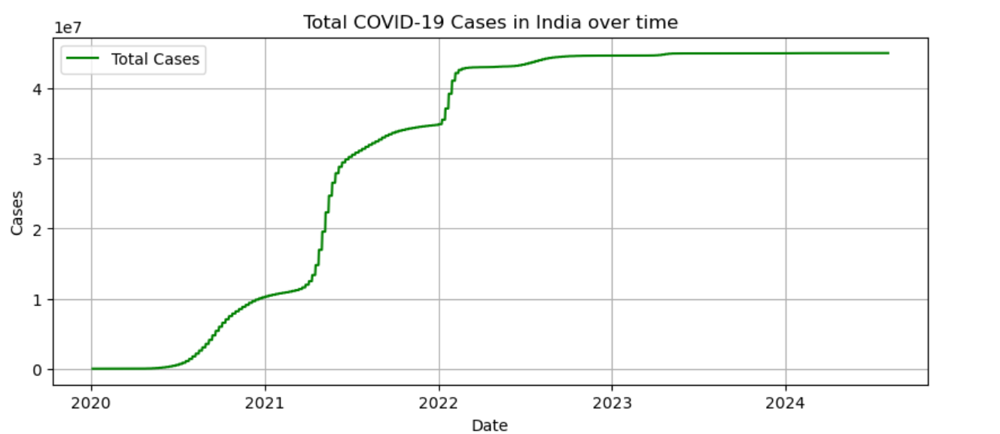
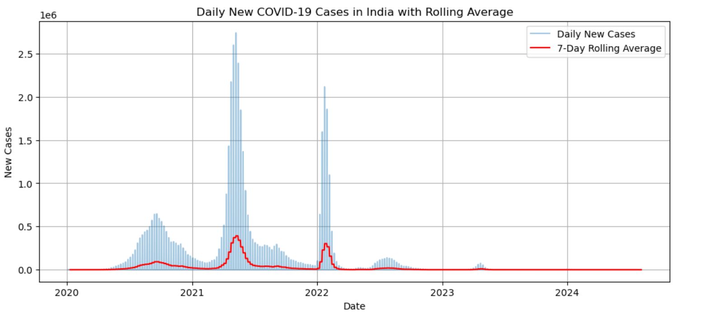
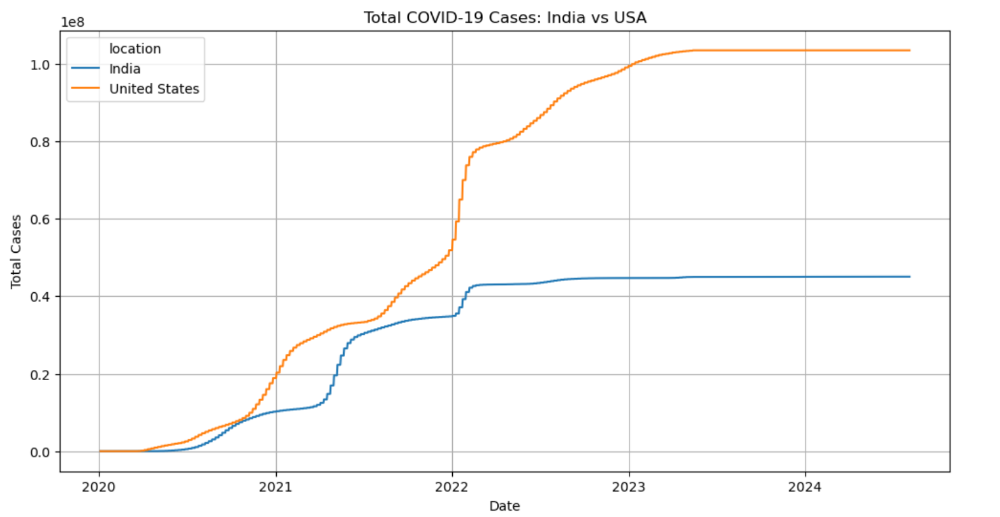

# covid-19-data-analysis 
A mini project analyzing the COVID-19 data using Pandas and Visualization
This project provides a comprehensive analysis of COVID-19 trends using data from **Our World in Data**. It covers the case growth, vaccination progress, country comparisons, and key statistics using Python libraries such as 'Pandas','matplotlib' and 'seaborn'.
----
## Project Overview

- Analyze the COVID-19 spread and vaccinations in **India**
- Compare the COVID-19 trends between **India** and the **United States**
- Use **time-series plots**,**rolling averages** and **correlation heatmaps**
- Visualize the top vaccinated countries
- Practice real-world data handling with a large dataset

----
## Tools & Technologies:

- **Python 3**
- **Pandas** -: Data Wrangling
- **matplotlib** & **Seaborn** -: Visualizations
- **Jupyter Notebook**
- Dataset Source: [Our World in Data](https://covid.ourworldindata.org/)

----
# Dataset

- **Source** -: [OWID COVID-19 Data](https://covid.ourworldindata.org/data/owid-covid-data.csv)
- **Columns Used** -:
    - 'location','date','total_Cases','new_cases'
    - 'total_deaths','new_deaths','people_vaccinated'

----
## Dataset not included
Due to GitHub's file size limit, the full 'owid-covid-data.csv' file is **not included** in this repository.

To run the notebook locally:
1. Download the dataset from:
   [https://covid.ourworldindata.org/data/owid-covid-data.csv](https://covid.ourworldindata.org/data/owid-covid-data.csv)
2. Save it in the **same folder** as the notebook
3. Then run the notebook without errors.

----
## Key Analyses
### India-Specific Trends

- Total COVID-19 cases over time
- Daily new cases Trend
- Vaccination Progress
- 7-day rolling average of new cases

### Country Comparisons

- Compare **India vs USA** for totak and new cases
- Find the top 10 countries by vaccination numbers

### Insights

> Peak daily cases in India exceeded 400,000 during May 2021
> Vaccination in India crossed 1 billion doses
> The USA and India showed different wave patterns vaccination rollout speeds

## Sample Visualizations

### Total Cases Over Time(India)

### Daily New Cases with Rolling Average

###India vs USA - Total Cases Comparison

----

##Folder Structure

covid-analysis/
|
|--covid-19_data_analysis.ipynb #Main Jupyter Notebook
|--images/ #Folder for saved chart screenshots
| |--total_cases_india.png
| |--rolling_avg_india.png
| |--india_vs_usa_total_cases.png
|--README.md #This file
|--owid-covid-data.csv #Raw dataset

----
## What I Learned

- Handling large real-world datasets with missing values
- Time-series visualization using Python
- Comparing multi-country health data
- Presenting insights through charts and summaries

----
## How to Run

1. Clone this repository
2. Open 'COVID-19_data_analysis.ipynb' in Jupyter
3. Install requirements(if needed)
4. Run cells and modify the code for deeper insights

----
## Author

**Anagha Murali**
_B.E. Data Science[CSE-DS], 7th Semester_

----
## License

This mini project is open-source and free to use for learning and personal portfolios.
